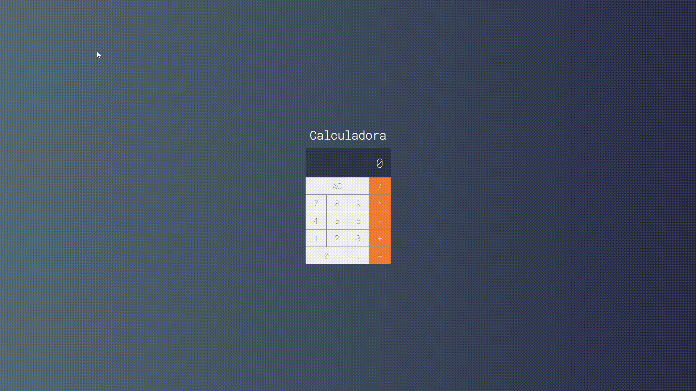

# Projeto Calculadora

## Instale as dependências

* Após realizar o download do projeto e entrar na pasta digite no terminal `npm install`

## Instale as dependências

* Para inicializar o projeto digite `npm start`
